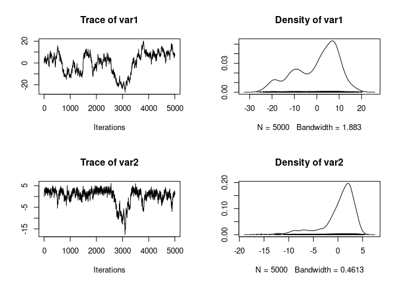

<!-- README.md is generated from README.Rmd. Please edit that file -->

# simpleMH

<!-- badges: start -->

[](https://www.tidyverse.org/lifecycle/#maturing)
<!-- badges: end -->

This package offers a very simple interface to use the
Metropolis-Hastings Monte Carlo Markov Chain algorithm. It is suitable
for teaching and testing purposes. For more advanced uses, you can for
example use the [mcmcensemble](https://bisaloo.github.io/mcmcensemble)
package, which is designed with a very similar interface, but offers
better convergence, especially for badly scaled problems or highly
correlated set of parameters.

## Installation

You can install the development version from GitHub:

``` r
# install.packages("remotes")
remotes::install_github("Bisaloo/simpleMH")
```

## Example

``` r
library(simpleMH)

## a log-pdf to sample from
p.log <- function(x) {
    B <- 0.03                              # controls 'bananacity'
    -x[1]^2/200 - 1/2*(x[2]+B*x[1]^2-100*B)^2
}

res <- simpleMH(
  p.log,
  inits = c(0, 0),
  theta.cov = diag(1, 2, 2),
  max.iter = 5000
)
```

``` r
plot(res$samples)
```



``` r
plot(as.data.frame(res$samples))
```


